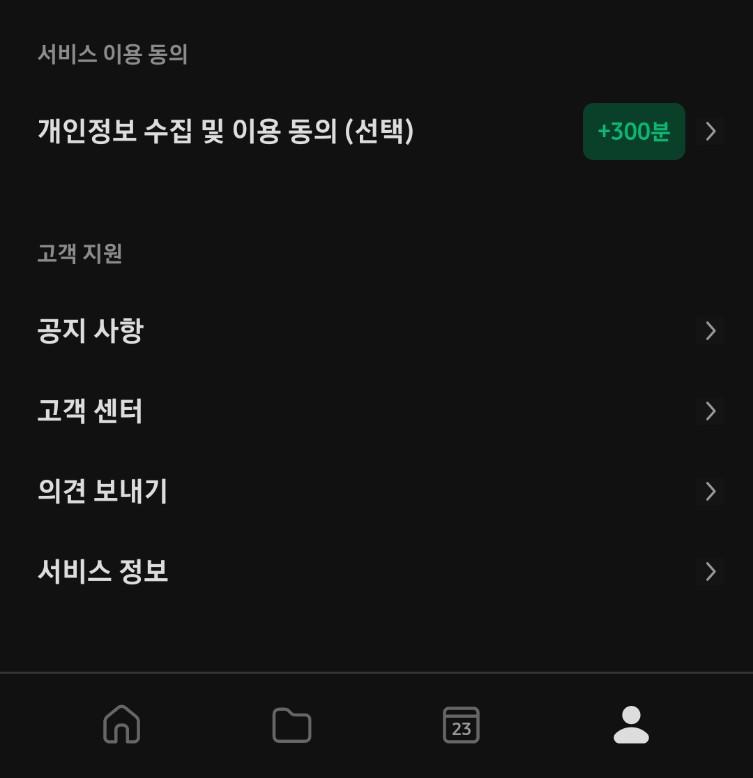
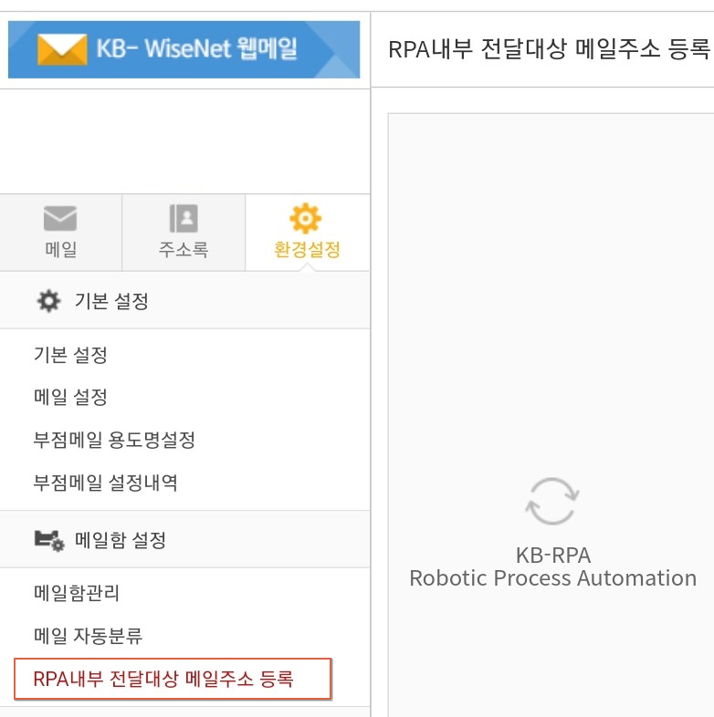
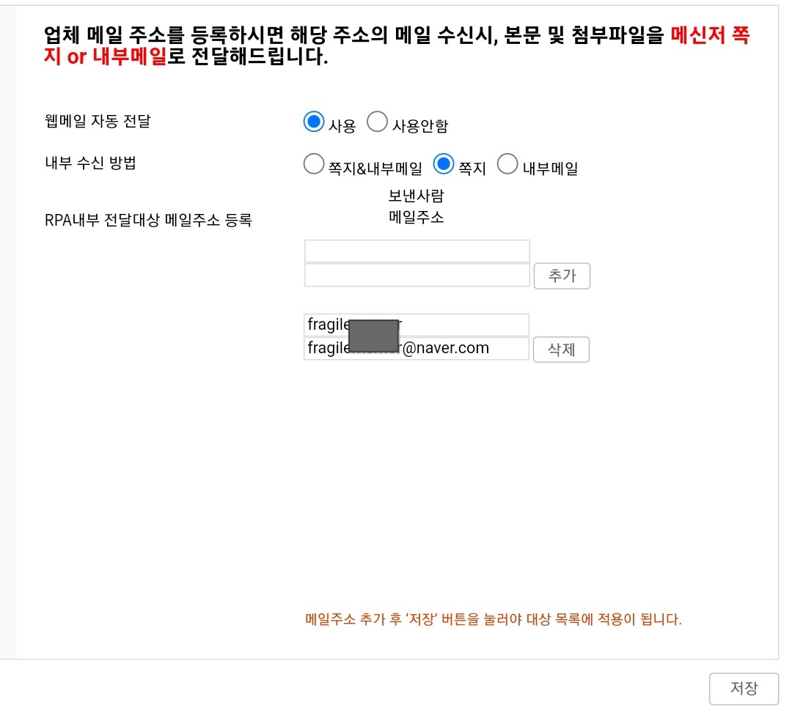
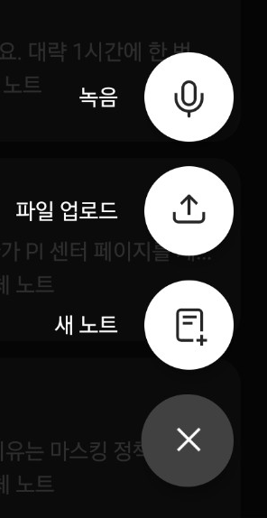
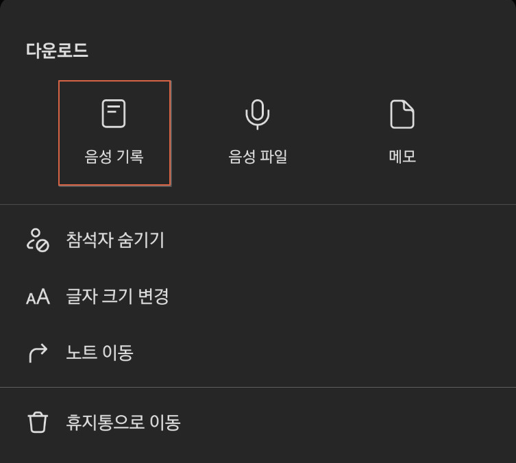
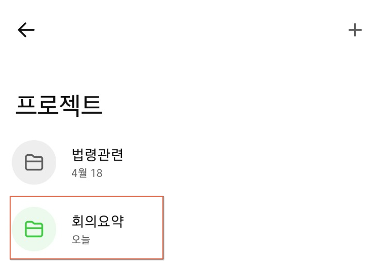
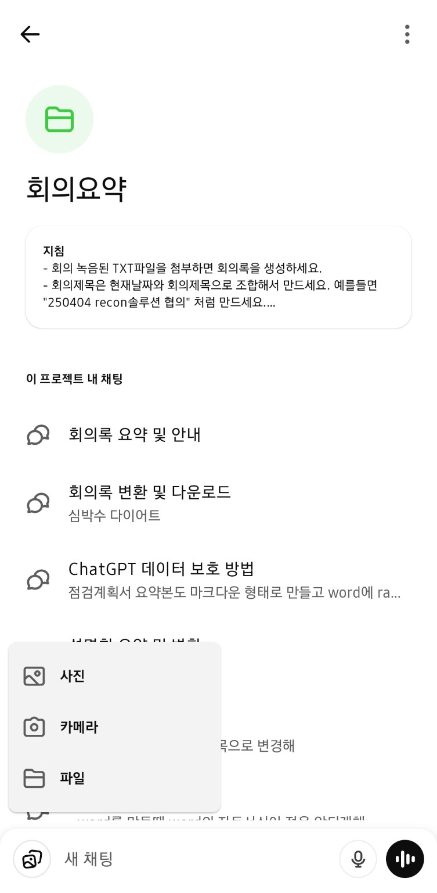
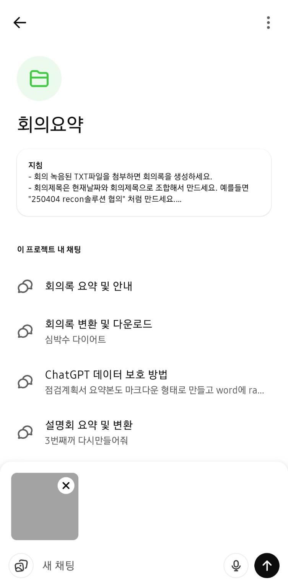
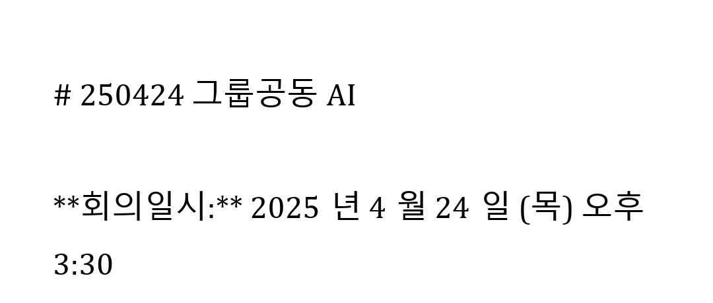

# AI기반 회의록 생성 가이드

이 가이드는 회의 녹음을 클로바노트를 통해 녹음한 후 텍스트로 변환하고, ChatGPT를 이용해 요약하여 워드 문서로 저장한 뒤, 웹메일 자동 RPA를 통해 내부 시스템으로 자동 반입되도록 설정하는 전체 과정을 안내합니다.

> 모든 작업은 **모바일 기준**이며, 별도의 컴퓨터 없이 진행할 수 있습니다.
---

## 0. 사전 필수 설정 (개인정보 비활성화 + 내부메일 자동 반입 설정)

### 0.1 ChatGPT 개인정보 학습 비활성화
- 고객정보 ChatGPT는 이미 되어 있습니다. 개인 ChatGPT를 사용하는 경우 설정하세요.
[ChatGPT 개인정보 학습 비활성화 하는방법](https://iroone.tistory.com/entry/ChatGPT%EC%B1%97%EC%A7%80%ED%94%BC%ED%8B%B0%EC%9D%98-%EA%B0%9C%EC%9D%B8%EC%A0%95%EB%B3%B4-%EB%B3%B4%ED%98%B8-%EA%B8%B0%EB%8A%A5-%EB%8D%B0%EC%9D%B4%ED%84%B0-%ED%94%84%EB%9D%BC%EC%9D%B4%EB%B2%84%EC%8B%9C-%EC%84%A4%EC%A0%95-%EB%B0%A9%EB%B2%95)

### 0.2 클로바노트 개인정보 수집 동의 비활성화  
- 설정 > `개인정보 수집 및 이용 동의(선택)` 항목을 비활성화

  


### 0.3 회사 웹메일 내부 반입(자동이 RPA) 사전 설정 필요
- **환경설정 > RPA내부 전달대상 메일주소 등록** 메뉴로 이동  
- 발신 이메일 주소를 등록해야 첨부파일이 자동 반입됩니다.

  



---

## 1. 회의 녹음 및 텍스트 저장 (ClovaNote)

### 1.1 클로바노트 실행 후 회의 녹음 또는 파일 업로드  
하단의 `+` 버튼 → **녹음 시작** 또는 **파일 업로드** 선택  
- **실시간 회의**는 `녹음`으로  
- **기존 음성파일**은 `업로드`로 처리




### 1.2 텍스트 내보내기
- 노트 완료 후 우측 상단 메뉴에서 `.txt` 형식으로 내보내기를 선택하세요.

  


---

## 2. ChatGPT 자동 요약

### 2.1 프로젝트 목록에서 '회의요약' 선택
- ChatGPT Plus의 프로젝트 기능을 이용해 미리 지침이 작성된 '회의요약' 프로젝트로 이동합니다.



### 2.2 txt 업로드
- 회의요약 프로젝트에 지침에 프롬프트가 미리 입력되어 있어, **프롬프트 입력 없이 `회의내용txt` 업로드만** 하면 요약 및 Word 변환이 진행됩니다.
- **개인 ChatGPT**를 사용하는 경우, `회의내용.txt` 업로드와 아래 프롬프트를 대화에 입력하세요.
```
- 회의 녹음된 TXT파일을 첨부하면 회의록을 생성하세요.
- 회의제목은 현재날짜와 회의제목으로 조합해서 만드세요. 예를들면 "250404 솔루션 협의" 처럼 만드세요.
- 회의일시, 참석자, 주요 안건 및 세부내용, 결정 사항, 액션 아이템을 포함하세요.
- 녹음된 TXT에 없는 이야기는 만들지 마세요.
- markdown으로 변환해서, word파일에 raw text 형태로 한글 깨지지 않게 만들고, 파일명은 회의제목과 동일하게 해서 다운로드 할수 있게 만드세요.
```




---

## 3. Word 파일 다운로드 및 이메일 전송

### 3.1 Word 파일 확인
- 다운로드된 파일을 열고 확인합니다.
- Word 파일 내용은 프로젝트 지침 대로 안되어 있는 경우가 있습니다.
  - Confluence 에 게시하기 위해서는 아래와 같이 Markdown Raw Text 형태(#, * 등 이 있어야함)가 아니라면, ChatGPT에게 **Markdown 형식으로 raw text 형태로 word파일 만들어줘** 라고 요청하고, 다시 다운로드 하세요.

  - Word 파일로 관리하고 싶은경우, Markdown형태로 Word파일이 만들어 진경우 **raw text 형태 말고, word파일 만들어줘** 라고 요청하고, 다시 다운로드 하세요.

### 3.1 이메일 전송
- ChatGPT가 제공한 `.docx` 파일을 다운로드한 후, **RPA 등록한 메일로 회사 메일 주소에 word파일을 첨부하고 전송**
- **Word** 파일과 같은 문서 파일만 RPA로 자동으로 반입됩니다.
- **발신자:** RPA에 등록한 메일 (예: `fragileXXX@naver.com`)
- **수신자:** 본인 회사 메일 (예: `kskXX@kbfg.com`)

### 3.2 내부 반입 파일 열기
- 웹메일 RPA가 정상적으로 설정된 경우 쪽지로 수신한 Word 파일을 로드합니다.
---

## 4. 내부망 Confluence 에 게시(선택사항)

### 4.1 Confluence 에 등록
- Word 내용이 Markdown Raw Text 형태로 저장되어 있어야 합니다.
- Confluence 에서 **게시할 페이지로 이동** 후에 가운데 상단 **만들기 옆 ... 버튼** 을 선택하고, **Import 회의록**을 선택하고 만들기를 선택 합니다.
- 페이지 제목을 작성하고, **markup으로 변경하고 추가하세요 내용을 삭제**하고, **Ctrl + Shift + d** 를 선택하여 **문법 삽입** 에 Word 내용을 복사하면 완료 입니다. 
