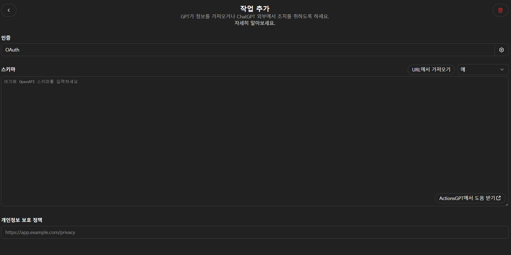
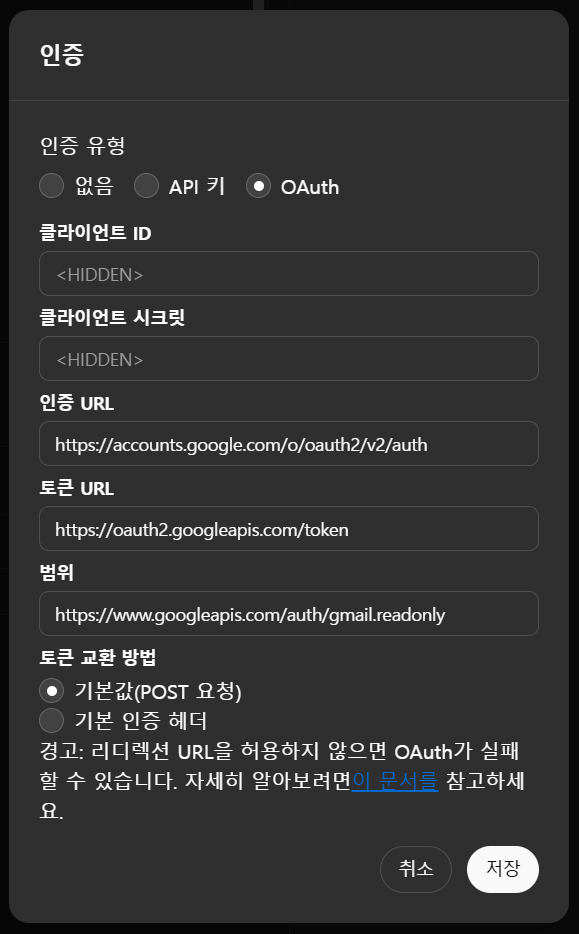
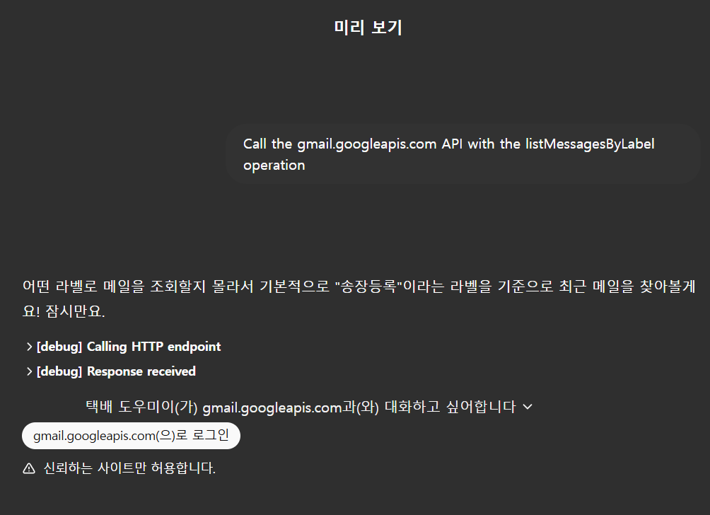
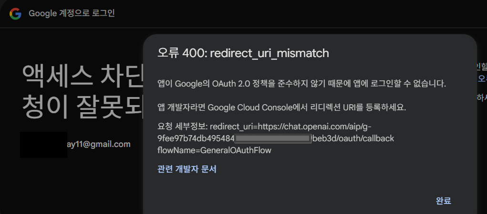
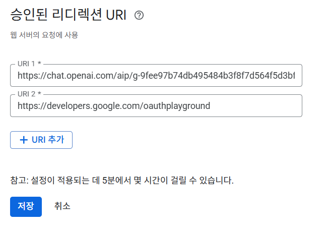

# 📄 Gmail API + CustomGPT 연동

---

## 1. Gmail OAuth 발급 전체 과정
> Gmail API는 인증시, API방식으로는 지운하지 않고, OAuth 2.0 만 지원함

### 1.1 작업 순서

- Google Cloud Console(GCP) 접속
- 새 프로젝트 생성
- Gmail API 활성화
- OAuth 동의 화면 설정
- OAuth 2.0 클라이언트 ID 생성
- 승인된 리디렉션 URI 등록

### 1.2 OAuth 인증 흐름 요약

- 사용자 → CustomGPT → Google 인증 요청
- 사용자가 구글 계정 로그인
- 동의 화면에서 권한 부여
- 승인되면 **Redirect URI**로 Authorization Code 전달
- CustomGPT가 이 코드로 **Access Token** 및 **Refresh Token** 발급

---

## 2. Google Cloud Console(GCP) 작업

### 2.1 Google Cloud Console 접속 및 프로젝트 생성

1. [Google Cloud Console](https://console.cloud.google.com/) 에 접속
2. 상단에서 **"프로젝트 선택"** → **"새 프로젝트 만들기"** 클릭
3. 프로젝트 이름 입력 (예: `gpt-gmail-integration`)
4. **"만들기"** 버튼 클릭


### 2.2 Gmail API 활성화

1. GCP 대시보드에서 **"API 및 서비스"** → **"라이브러리"** 이동
2. 검색창에 **"Gmail API"** 입력
3. **Gmail API 선택** → **"사용"** 버튼 클릭

---

### 2.3 OAuth 동의 화면 설정

1. **"API 및 서비스"** → **"OAuth 동의 화면"** →  **"대상"** 이동
2. 사용자 유형 선택
   - 대부분 **외부** (External) 선택
3. 앱 정보 입력
   - 앱 이름: 원하는 이름 입력
   - 사용자 지원 이메일: 본인 이메일
   - 개발자 연락처 이메일: 본인 이메일
4. 테스트 사용자 추가
   - 사용할 Gmail 계정을 등록

> `앱 게시`할 필요 없음
---

### 2.4 OAuth 2.0 클라이언트 ID 생성

1. **"API 및 서비스"** → **"사용자 인증 정보"** 이동
2. **"사용자 인증 정보 만들기"** 클릭 → **"OAuth 클라이언트 ID"** 선택
3. 애플리케이션 유형 선택
   - **웹 애플리케이션** 선택
4. 이름 지정 (예: `CustomGPT OAuth Client`)
5. 승인된 리디렉션 URI 추가
✅ CustomGPT용 리디렉션 URI는 다음처럼 등록해야 하는데, 아직은 ChatGPT와 연결을 안해서 입력 할 수 없음
```
https://chat.openai.com/aip/g-xxxxxxxxxxxxxxxxd/oauth/callback
```

6. **저장** 버튼 클릭
7. 발급된 **클라이언트 ID**와 **클라이언트 시크릿(보안 비밀번호)**을 기록

---


## 3. Gmail을 ChatGPT(CustomGPT)와 연결

### 3.1 내 GPT 에서 새 작업 추가

- CustomGPT에서 **"Actions(새 작업 만들기)"** 클릭
- 인증 → OAuth

| 항목 | 입력 값 |
|------|---------|
| 인증 유형 | OAuth |
| 클라이언트 ID | (GCP에서 발급) |
| 클라이언트 시크릿 | (GCP에서 발급) |
| 인증 URL | https://accounts.google.com/o/oauth2/v2/auth |
| 토큰 URL | https://oauth2.googleapis.com/token |
| 범위 | https://www.googleapis.com/auth/gmail.readonly |

> 🔹 범위가 여러 개이면 띄어쓰기로 이어서 입력  
> 🔹 예: `scope1 scope2`



### 3.2 OpenAPI 스키마 입력

```yaml
openapi: 3.1.0
info:
  title: Gmail API Actions
  version: 1.0.0
  description: Gmail label search, message detail, attachment download actions for 송장등록 emails.
servers:
  - url: https://gmail.googleapis.com/gmail/v1
paths:
  /users/me/messages:
    get:
      operationId: listMessagesByLabel
      summary: Search Gmail messages with "송장등록" label
      parameters:
        - name: q
          in: query
          required: true
          schema:
            type: string
          example: 'label:송장등록 has:attachment'
          description: Gmail search query (e.g., label and attachments filter)
        - name: maxResults
          in: query
          required: false
          schema:
            type: integer
            default: 10
          description: Number of results to return
      security:
        - bearerAuth: []
      responses:
        '200':
          description: List of messages
          content:
            application/json:
              schema:
                type: object
                properties:
                  messages:
                    type: array
                    items:
                      type: object
                      properties:
                        id:
                          type: string

  /users/me/messages/{messageId}:
    get:
      operationId: getMessageById
      summary: Get full Gmail message by ID
      parameters:
        - name: messageId
          in: path
          required: true
          schema:
            type: string
          description: The ID of the Gmail message to retrieve
      security:
        - bearerAuth: []
      responses:
        '200':
          description: Full message metadata and payload
          content:
            application/json:
              schema:
                type: object
                properties:
                  id:
                    type: string
                  snippet:
                    type: string
                  payload:
                    type: object

  /users/me/messages/{messageId}/attachments/{attachmentId}:
    get:
      operationId: downloadAttachment
      summary: Download attachment from a Gmail message
      parameters:
        - name: messageId
          in: path
          required: true
          schema:
            type: string
        - name: attachmentId
          in: path
          required: true
          schema:
            type: string
      security:
        - bearerAuth: []
      responses:
        '200':
          description: Base64-encoded attachment
          content:
            application/json:
              schema:
                type: object
                properties:
                  data:
                    type: string
                    description: Base64 encoded attachment data
components:
  securitySchemes:
    bearerAuth:
      type: http
      scheme: bearer
  schemas: {}
```
- 입력이 완료되면 가능한 작업이 생성되고 테스트가 가능함


- 테스트 할때 OAuth 인증을 요청하는데 redirect_uri_mismatch 오류가 발생함

- 이 오류는 CustomGPT에서 사용하는 리디렉션 URI가 GCP에 등록된 URI가 등록이 되지 않아 발생함
- 따라서, CustomGPT에서 사용하는 리디렉션 URI를 GCP에 등록해야 함
- CustomGPT에서 사용하는 리디렉션 URI는 아래와 같은 형식이며, Google 계정으로 로그인 창에서 `400 오류:redirect_url_mismatch` 오류가 발생했을 때 `오류 세부정보`를 클릭하면 확인 가능함
```
https://chat.openai.com/aip/g-xxxxxxxxxxxxxxxxxd/oauth/callback
```

- 오류 세부정보에 나온 URI를 2.4 항목으로 이동하여 등록

---

## 4. 최종 점검 체크리스트 ✅

- [x] Gmail API 활성화 완료
- [x] OAuth 동의 화면 작성 완료
- [x] 테스트 사용자 등록 완료
- [x] OAuth 클라이언트 ID, 시크릿 발급 완료
- [x] CustomGPT에 OAuth 인증 정보 입력 완료
- [x] 승인된 리디렉션 URI 정확히 입력 완료

---


## 5. 문제점

### 5.1 첨부파일 파싱 이슈

- ChatGPT는 Base64로 인코딩된 데이터를 직접 디코딩하거나 엑셀 파일과 같은 바이너리 파일을 해석하는 데 어려움이 있음.
- 따라서, 첨부파일의 내용을 파싱하여 활용하려면 별도의 외부 도구를 사용해야 함(프롬프트로 처리 안됨)

---

## 6. 결론
- Gmail API와 CustomGPT 연동은 OAuth 인증 및 API 호출까지는 성공적으로 가능함.
- 하지만, 첨부파일의 내용을 파싱하여 활용하는 것은 CustomGPT의 한계로 인해 불가능함.
- 첨부파일 내용을 활용하려면, 별도의 서버에서 첨부파일을 다운로드하고 파싱하는 방식을 고려해야 함.
- Google Action Script를 통해 첨부파일을 Google Drive로 이동하고 Google Drive API를 이용하면 됨.
